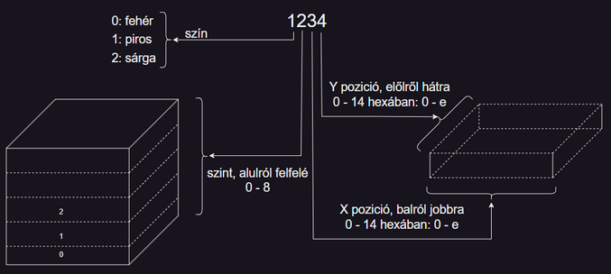

# Ajándék  
  
Azért erre az útra hívott meg a kapitány, mert az út harmadik napjára esik a születésnapja, és ezt szeretné a társaságotokban ünnepelni. Esti vacsora közben a ceremóniamester megemlítette a kapitány születésnapját is, de az igazi ünneplésre csak késő este a személyzet pihenőtermében került sor.  
A születésnapi partira természetesen Bence is hivatalos. Szinte az egész napot a játszóházban töltötte ahonnan nagyon vidáman egy kis becsomagolt dobozkával jött ki: ajándékot készített a kapitánynak!  
Amint belépett a partinak otthont adóterembe és meglátta a kapitányt, odarohant hozzá, és odaadta neki.  
-Ezt neked készítettem! Óvatosan bontsd ki, ne essen szét!  
A csomag egy lego kockákból épített nagyjából kocka alakú építményt takart.  
-Wow! Nagyon szép! Ezt a vitrinemben fogom tartani. És emlékeztet arra, hogy hány éves vagyok.  
-Csak egy évig pontos. Apa mondta, hogy nem biztos, hogy jövőre is meghívsz minket, és így már meg kell hívnod minket, hogy csináljak újat!  
Kapitány nagyot nevet.  
-Hát ezek után már tényleg nem lehet máshogy, jövőre is hajókázni fogtok.  
  
A mellékelt `ajandek.txt` fájlban található az ajándék térbeli leírása.  
Az első sorban egyetlen szám található: `N`  
A második sortól kezdve `N` darab 4 jegyű pozíció leíró található, 16-osával sorokba rendezve, sorok közben szóközökkel elválasztva.  
Ezt úgy kell elképzelni, hogy a teret felbontottuk 1x1x1-es lego kocka méretű pozíciókra, és az építményben az ezek közül lego elemet tartozók színei és pozíciója található.  
1. karakter szín:  
    `0`: fehér  
    `1`: piros  
    `2`: sárga  
2-4. karakterek `x`,`z`,`y` koordináták  

  
  
1. Hány darab kocka pozíció piros színű?  
2. Bence az építmény belsejében egy üreget hagyott. Hány 1*1*1 -es egységnyi térfogatú ez az üreg?  
3. Hány éves a kapitány?  
